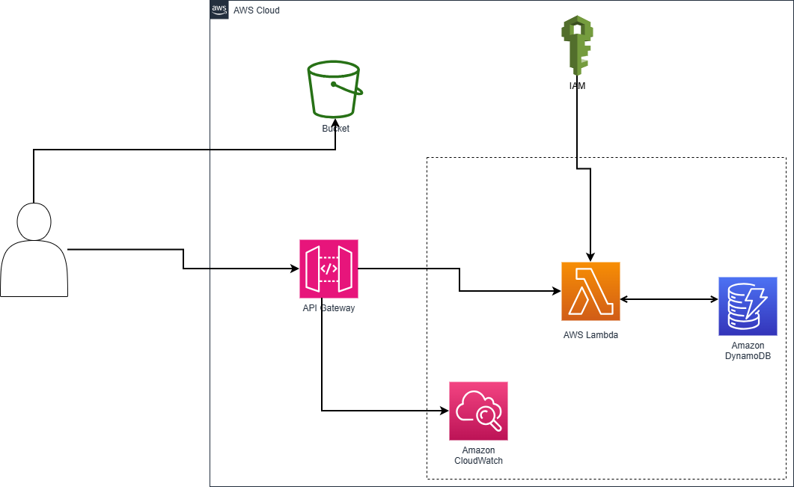

# Serverless REST API with DynamoDB and API Gateway

---

## Architecture Diagram

---

## Architecture Overview

- The frontend (HTML/JS) is hosted on **Amazon S3** as a static website.
- Four **AWS Lambda** functions are used to handle Create, Read, Update, and Delete (CRUD) operations.
- **Amazon API Gateway** exposes four corresponding REST endpoints.
- Lambda functions have appropriate **IAM roles** granting access to **Amazon DynamoDB**.
- A **DynamoDB** table stores the to-do list or customer records.
- **CloudWatch** is used for logging and monitoring Lambda executions and API activity.

---

## System Flow

1. The user accesses the frontend hosted on **S3**.
2. The frontend sends HTTP requests to **API Gateway**.
3. **API Gateway** routes the request to the appropriate **Lambda function**.
4. The Lambda function performs the necessary operation on the **DynamoDB table**.
5. The result is returned back to the frontend.

---

## Key AWS Services Used

- **Amazon API Gateway**: Exposes REST endpoints.
- **AWS Lambda**: Handles API requests (CRUD operations).
- **Amazon DynamoDB**: NoSQL database for storing records.
- **AWS IAM**: Controls access via roles and permissions.
- **Amazon CloudWatch**: Logs and monitors API activity.
- **Amazon S3**: to host the front-end of your application.

---

## Learning Outcomes

- Designing scalable, event-driven serverless applications.
- Implementing API Gateway with Lambda for stateless execution.
- Using DynamoDB as a managed NoSQL database with best practices.
- Securing APIs using IAM roles and resource policies.

---

**Developed by:** Oussama Nairi
